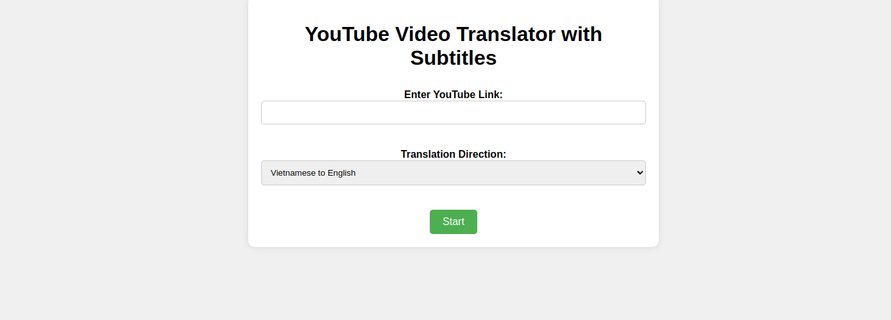

# YouTube Video Translator

This project translates YouTube videos by extracting audio, transcribing it, and translating the text. The translated subtitles are then added back to the video.



## Features

- Download YouTube videos
- Extract audio from videos
- Transcribe audio to text
- Translate text between Vietnamese and English
- Create subtitle files and convert them to VTT format
- Serve the translated video with subtitles through a web interface

## Prerequisites

- Docker
- Docker Compose

## Installation

1. Clone the repository:
   ```sh
   git clone https://gitlab.com/your-username/youtube-video-translator.git
   cd video_translator
   ```

2. Build and run the Docker containers using Docker Compose
    ```sh
    docker compose up --build
    ```

## Usage
- Open your web browser and go to http://localhost:5000.
- Enter the YouTube link of the video you want to translate.
- Select the translation direction (Vietnamese to English or English to Vietnamese).
- Submit the form and wait for the processing to complete.
- The translated video with subtitles will be available for download.

## Note
- First time you using it will download model from hugging face so you need to wait

## Project Structure
- app.py: The main Flask application.
- youtube_downloader.py: Module for downloading YouTube videos.
- audio_extractor.py: Module for extracting audio from video files.
- transcriber.py: Module for transcribing audio to text.
- translator.py: Module for translating text using the transformers pipeline.
- subtitle_creator.py: Module for creating subtitle files.
- utils.py: Utility functions, including converting SRT files to VTT.
- config.py: Configuration file containing model names and device settings.
- requirements.txt: Python dependencies.
- Dockerfile: Dockerfile for building the Docker image.
- docker-compose.yml: Docker Compose configuration file.

## Configuration
The configuration settings, including model names and device settings, are located in config.py.

## Dependencies
- Python 3.9
- Flask
- transformers
- sentencepiece
- torch
- torchaudio
- accelerate
- yt-dlp
- openai-whisper
- moviepy

## Development
To run the application locally without Docker, follow these steps:

Install the required Python packages:
If you using Window you need to install ffmpeg follow this link: [Install](https://www.geeksforgeeks.org/how-to-install-ffmpeg-on-windows/).


```sh
pip install -r requirements.txt
sudo apt install ffmpeg
```

Run the Flask application:

```sh
python app.py
```

Open your web browser and go to http://localhost:5000.

## License
This project is licensed under the MIT License. See the LICENSE file for details.

## Acknowledgments
- Transformers by Hugging Face
- PyTube for downloading YouTube videos
- Whisper for transcription